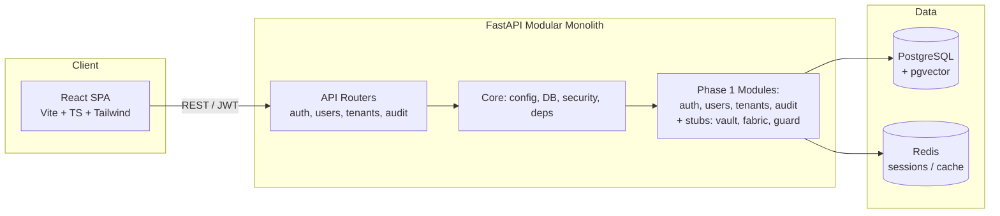
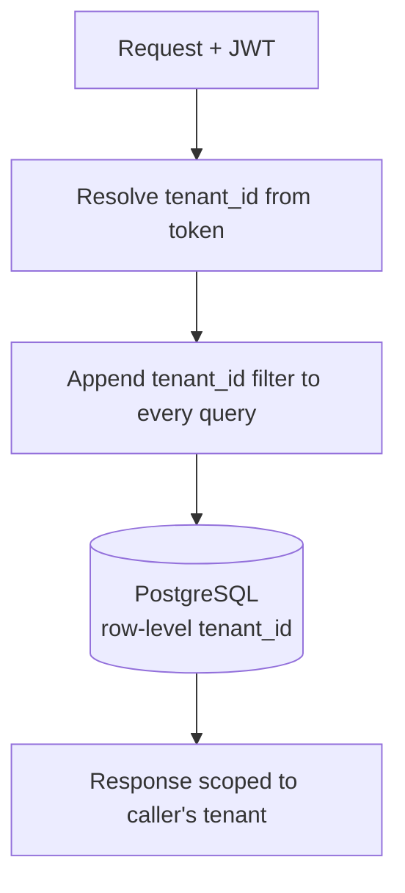
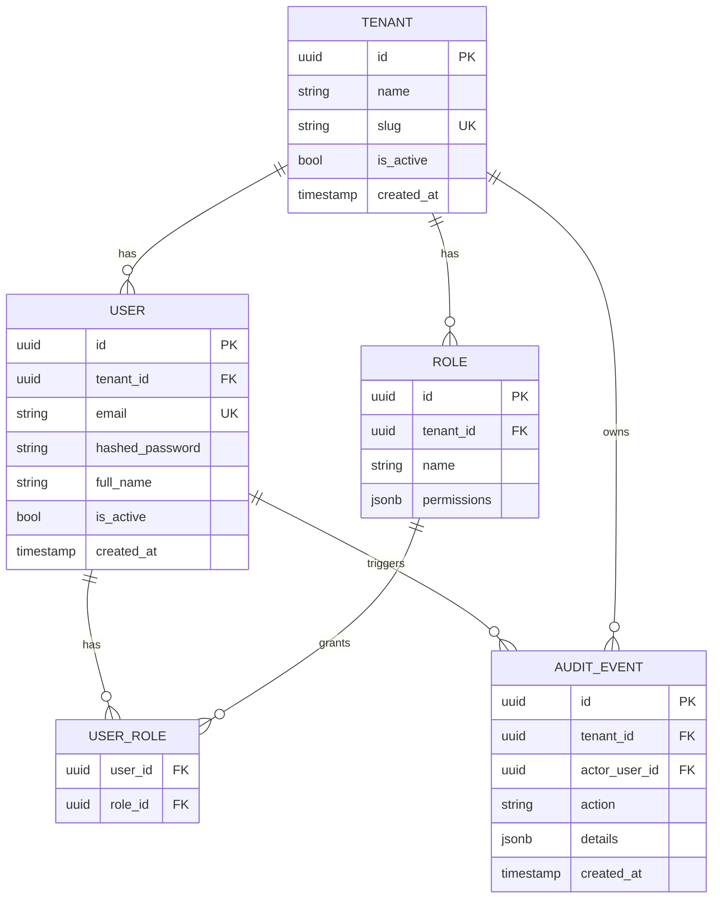

# KOREUM OS — Phase 1 Plan & Architecture

> Enterprise Agentic AI Operating Platform
> Phase 1: Foundation (repository, Docker Compose, FastAPI, React, auth, users, tenants, RBAC, basic dashboard)

This document fulfils the "FIRST RESPONSE" requirement of the master build prompt:
architecture overview, Mermaid diagram, repo structure, tech decisions, DB entity
model, Phase 1 implementation plan, exact commands, security considerations, and
risks/trade-offs. After this, Phase 1 code is delivered as a runnable scaffold.

---

## 1. Koreum OS Architecture Overview

Koreum OS is a modular monolith organised around three pillars:

- **Koreum Vault** — Knowledge Intelligence Layer: ingestion, parsing, chunking,
  embeddings, vector search, knowledge graph, RAG.
- **Koreum Fabric** — Multi-Agent Intelligence & Workflow Orchestration: agents,
  tools, supervisor, workflows, human-in-the-loop approvals.
- **Koreum Guard** — Security, Governance, Risk & Compliance: authn/authz, RBAC,
  tenant isolation, audit, policy, AI governance.

Phase 1 delivers the **foundation** all three pillars sit on: a FastAPI modular
monolith, a React SPA, PostgreSQL with pgvector, Redis, JWT auth, multi-tenancy,
RBAC, migrations, tests, and a basic dashboard.

### Design principles followed from the spec

- **Modular monolith first** — one deployable backend, clear module boundaries,
  ready to decompose into services later.
- **Provider independence** — LLMProvider/EmbeddingProvider abstractions (wired in
  Phase 2; the Gemini default is configured but no business logic hard-codes it).
- **Tenant isolation from day one** — every domain table carries `tenant_id`;
  every query path enforces it.
- **Auditability** — a generic `audit_events` table is created now and written on
  auth events; later phases extend it.
- **Security first** — JWT + refresh tokens, hashed passwords, RBAC enforced via a
  dependency, never bypassed for convenience.

---

## 2. MVP Architecture Diagram (Mermaid)



Tenant isolation boundary:



---

## 3. Repository Structure

```
koreum-os/
├── backend/
│   ├── app/
│   │   ├── main.py
│   │   ├── config.py
│   │   ├── database.py
│   │   ├── security.py
│   │   ├── deps.py
│   │   ├── models/
│   │   │   ├── __init__.py
│   │   │   ├── base.py
│   │   │   ├── user.py
│   │   │   ├── tenant.py
│   │   │   ├── role.py
│   │   │   └── audit.py
│   │   ├── schemas/
│   │   │   ├── __init__.py
│   │   │   ├── auth.py
│   │   │   ├── user.py
│   │   │   ├── tenant.py
│   │   │   └── audit.py
│   │   ├── api/
│   │   │   ├── __init__.py
│   │   │   ├── router.py
│   │   │   ├── auth.py
│   │   │   ├── users.py
│   │   │   ├── tenants.py
│   │   │   └── audit.py
│   │   ├── modules/
│   │   │   ├── vault/        # stub (Phase 2)
│   │   │   ├── fabric/       # stub (Phase 4)
│   │   │   └── guard/        # stub (Phase 6)
│   │   └── core/             # future: llm, embeddings, vector_store, tools...
│   ├── alembic/
│   │   ├── env.py
│   │   └── versions/
│   │       └── 0001_init.py
│   ├── tests/
│   │   ├── conftest.py
│   │   ├── test_health.py
│   │   ├── test_auth.py
│   │   └── test_users.py
│   ├── alembic.ini
│   ├── requirements.txt
│   ├── Dockerfile
│   └── .env.example
├── frontend/
│   ├── src/
│   │   ├── main.tsx
│   │   ├── App.tsx
│   │   ├── api/client.ts
│   │   ├── context/AuthContext.tsx
│   │   ├── pages/Login.tsx
│   │   ├── pages/Dashboard.tsx
│   │   ├── pages/Users.tsx
│   │   ├── pages/Tenants.tsx
│   │   ├── pages/AuditLogs.tsx
│   │   └── components/Layout.tsx
│   ├── index.html
│   ├── package.json
│   ├── tsconfig.json
│   ├── vite.config.ts
│   ├── tailwind.config.js
│   └── Dockerfile
├── infrastructure/
│   └── docker-compose.yml
├── docs/
│   └── Koreum_OS_Phase1_Plan.md   (this file)
├── scripts/
│   └── dev.sh
├── .env.example
├── .gitignore
└── README.md
```

---

## 4. Technology Decisions

| Concern            | Choice                                   | Why |
|--------------------|------------------------------------------|-----|
| Backend            | Python 3.12 + FastAPI                    | Async, OpenAPI auto-docs, modular, per spec |
| Validation         | Pydantic v2                              | Native to FastAPI |
| ORM                | SQLAlchemy 2.x (async)                   | Mature, async, works with Alembic |
| Migrations         | Alembic                                  | Standard for SQLAlchemy |
| DB                 | PostgreSQL 16 + pgvector                 | Relational + vectors in one store; spec default |
| Cache/Queue        | Redis 7                                  | Sessions, future task queue |
| Auth               | JWT (access + refresh), passlib[bcrypt]  | Stateless, RBAC-friendly |
| LLM abstraction    | LLMProvider protocol; default = Gemini   | Provider-independent per spec; Gemini configured |
| Frontend           | Vite + React + TypeScript                | Chosen by you; fast local dev |
| Styling            | Tailwind CSS                             | Per spec; enterprise-clean |
| Containers         | Docker Compose                           | One-command local dev |
| Testing            | pytest + httpx + pytest-asyncio          | Backend unit + integration |

Provider independence note: the `LLMProvider`/`EmbeddingProvider` abstractions are
scaffolded as protocols in `app/core/` with a Gemini implementation registered by
config (`LLM_PROVIDER=gemini`). No business logic imports a concrete provider
directly.

---

## 5. Database Entity Model (Phase 1)



Key points:
- UUIDs for all major entities (per spec).
- `tenant_id` on every domain table — isolation enforced in queries.
- `roles.permissions` is a JSONB list of permission strings (e.g.
  `["users:read","agents:execute"]`), kept flexible for now; can be normalised
  later.
- Seed roles: `ADMIN`, `PLATFORM_ADMIN`, `AI_ADMIN`, `MANAGER`, `USER`, `AUDITOR`
  (per spec §16).
- `audit_events` is generic — `action` + `details` JSONB — so all future phases
  extend it without schema changes.

---

## 6. Phase 1 Implementation Plan

1. **Repo & infra** — monorepo layout, `docker-compose.yml`, Dockerfiles,
   `.env.example`, `.gitignore`, `README.md`.
2. **Backend core** — config (pydantic-settings), async SQLAlchemy session,
   security module (JWT, hashing), shared dependencies (current user, current
   tenant, permission checks).
3. **Models & migrations** — Tenant, User, Role, UserRole, AuditEvent; Alembic
   init migration; seed roles + a default admin on first run.
4. **API routers** — `/health`, `/auth/login` + `/auth/refresh`, `/users` CRUD
   (admin), `/tenants` (platform admin), `/audit` (auditor). OpenAPI tags per
   module.
5. **Frontend** — Tailwind layout + sidebar, login page, auth context with JWT
   storage + axios interceptor, dashboard, users list, audit log list.
6. **Tests** — health, auth login/refresh, users RBAC, tenant isolation.
7. **Validation** — bring up compose, run migrations, login as seeded admin,
   visit dashboard.

Phase 1 delivers a **fully running** app. Phases 2–8 are explicitly deferred per
spec §44; stubs for `vault`, `fabric`, `guard` exist as empty modules so imports
resolve and the layout is ready.

---

## 7. Exact Development Commands

```bash
# 1. Unzip the scaffold and open in VSCode
unzip koreum-os-phase1.zip -d koreum-os
cd koreum-os
code .

# 2. Copy env
cp .env.example .env          # edit secrets (JWT_SECRET, GEMINI_API_KEY)

# 3. Backend env
python -m venv backend/.venv
source backend/.venv/bin/activate
pip install -r backend/requirements.txt

# 4. Start data services
docker compose -f infrastructure/docker-compose.yml up -d postgres redis

# 5. Run migrations + seed
cd backend
alembic upgrade head
# seed admin is created by the migration; credentials in .env (default admin@koreum.local / Admin123!)

# 6. Run backend
uvicorn app.main:app --reload --port 8000
# OpenAPI: http://localhost:8000/docs

# 7. Run frontend (new terminal)
cd frontend
npm install
npm run dev
# App: http://localhost:5173
```

Run tests:
```bash
cd backend
pytest -v
```

---

## 8. Security Considerations

- **JWT** — short-lived access token (15 min) + refresh token (7 d), signed with
  `JWT_SECRET` from env. Never hard-coded.
- **Passwords** — bcrypt via passlib; never stored or logged in plaintext.
- **RBAC** — `require_permission("users:write")` dependency on mutating endpoints;
  read-only roles get read permissions only.
- **Tenant isolation** — `tenant_id` resolved from the JWT on every request and
  injected into all queries; cross-tenant access returns 404 (not 403) to avoid
  leaking existence.
- **Audit** — login, login_failure, user_create, user_update, tenant_create are
  written to `audit_events` immediately.
- **Input validation** — Pydantic schemas on every endpoint; no raw dict inputs.
- **Secrets** — `.env` is gitignored; only `.env.example` ships.
- **CORS** — restricted to the frontend origin in production (dev: localhost:5173).

Defences intentionally deferred to later phases (flagged in spec):
prompt-injection protection (Phase 6), tool permission enforcement (Phase 4),
PII detection (Phase 6).

---

## 9. Risks and Trade-offs

| Risk / Trade-off | Mitigation |
|------------------|------------|
| Modular monolith can become a big ball of mud | Strict module boundaries; no cross-imports except via `api/` routers and `deps.py` |
| JSONB permissions on roles is flexible but not referential | Acceptable for MVP; normalise to a join table if enforcement gets complex |
| pgvector for everything may not scale at very large corpora | Vector-store abstraction layer lands in Phase 2 specifically to allow swapping to Pinecone/Qdrant |
| Seeded admin in a migration is convenient but a footgun | Credentials in `.env`, forced password change hook is a Phase 1.5 TODO |
| Sync seed in async context | Migration runs synchronously via Alembic's standard env; acceptable one-time cost |

---

## 10. Next Phase (after Phase 1 is verified working)

**Phase 2 — Koreum Vault**: document upload, parsing, chunking, embeddings
(Gemini default via `EmbeddingProvider`), pgvector storage, semantic + hybrid
search, metadata, document permissions, working RAG. The `modules/vault/` stub
and the `core/embeddings`, `core/vector_store` abstractions are already in place
to receive it.

Per spec §44: **stop after Phase 1 and wait for confirmation before Phase 2.**
